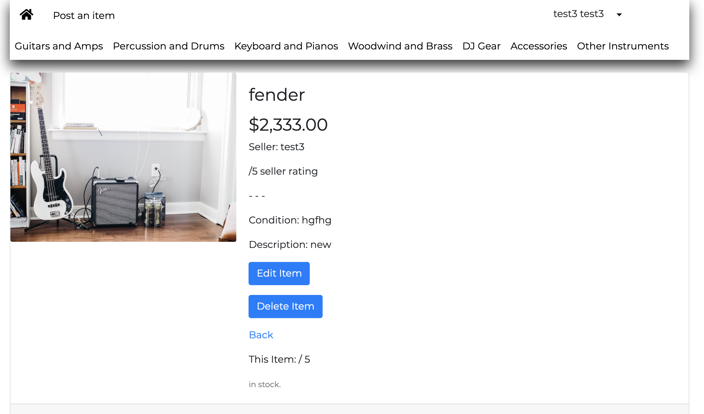
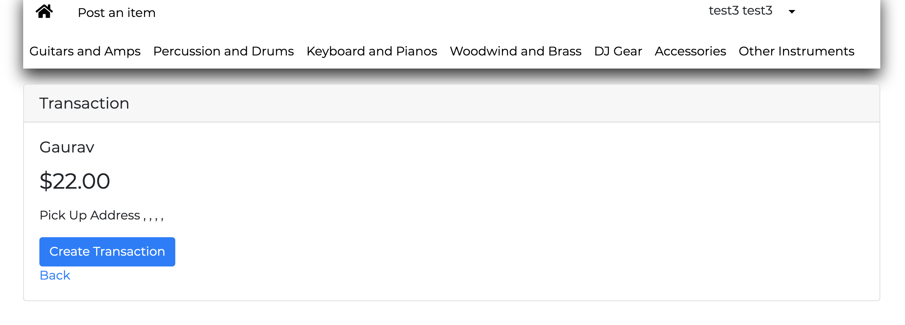
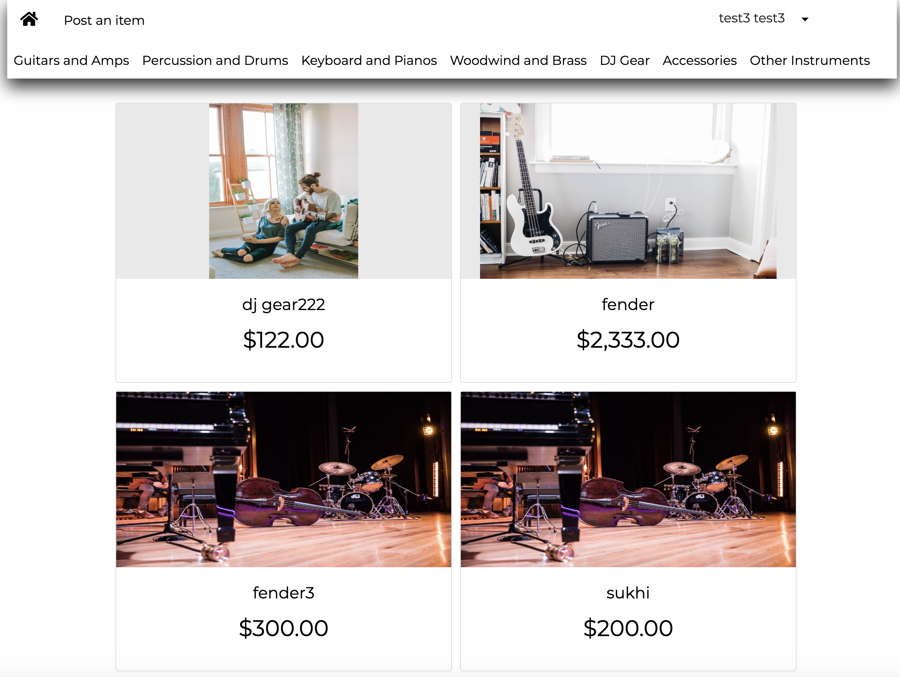
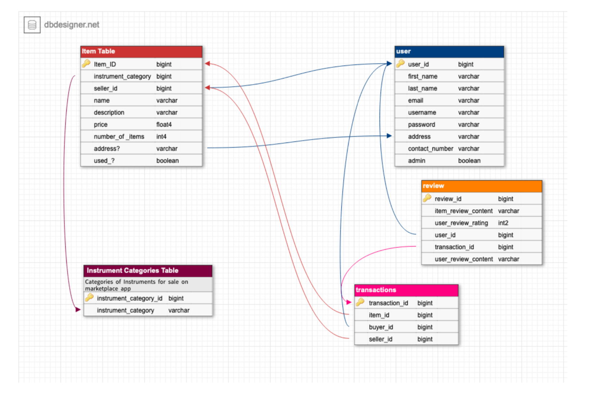
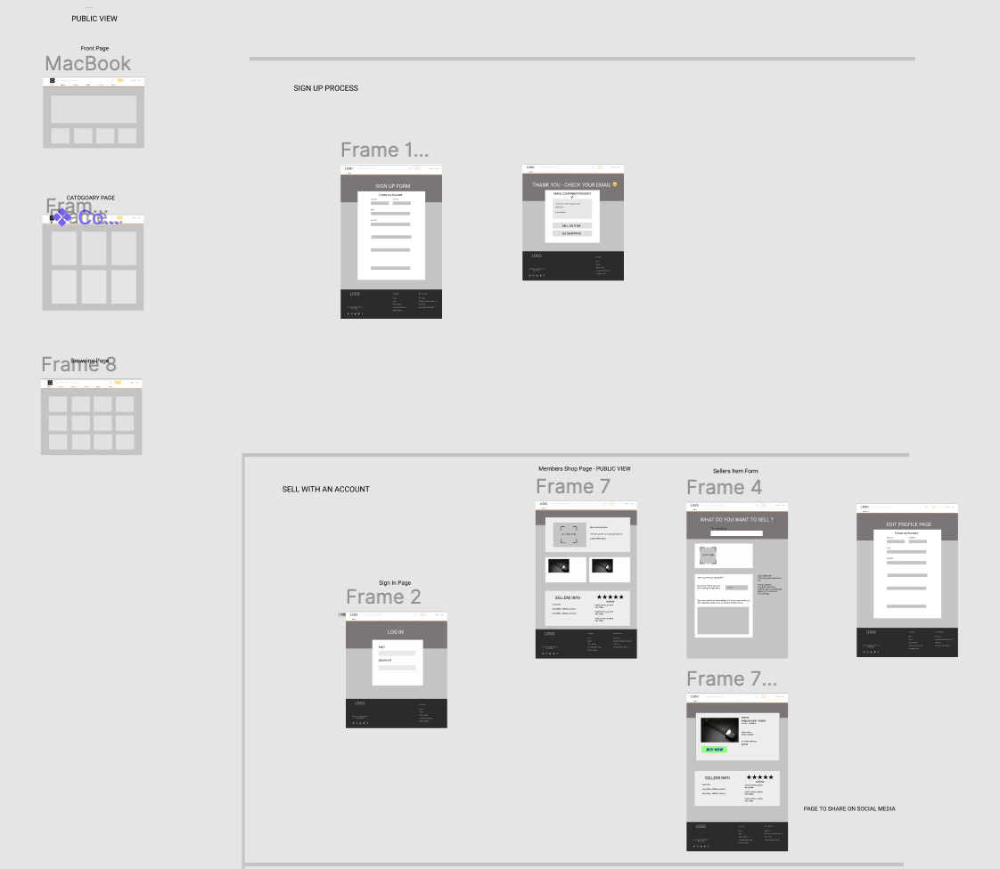
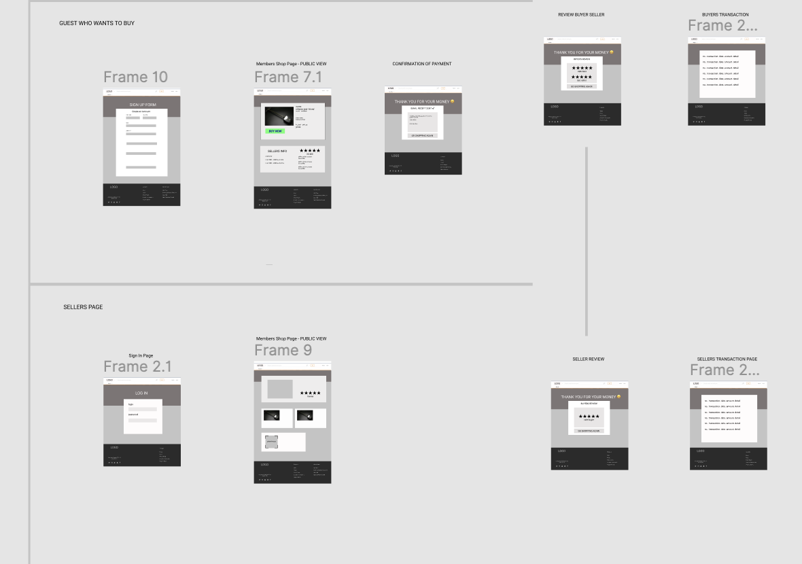
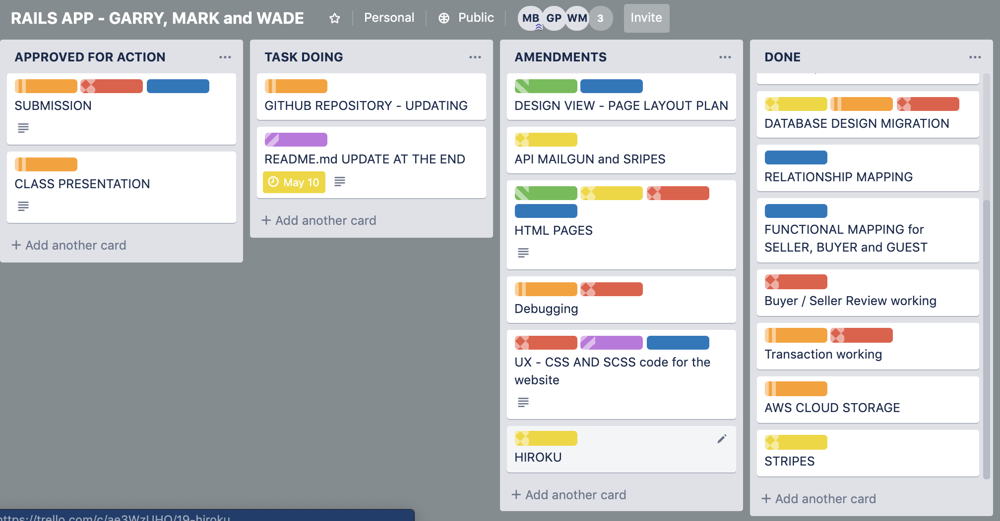

# README - MARKET PLACE

# Website

https://intense-garden-53703.herokuapp.com

# Link to Github repository

https://github.com/Wade-Martin/rails_marketplace_app

# PROJECT INFORMATION 

# SUMMARY

Melbourne is the music capital of Australia and ranks as highest among major cities in the world. It has one venue per 9,503 residents, which is better than London (1 per 34,350), New York (1 per 18,554) and LA (1 per 19,607). It live-music venues attach around 112,000 punters each Saturday night and generated $1.4billion in 2017.
Melbourne musicians currently use a range of online website to trade music equipment and most of which are international sites. Websites like eBay, Reverb are among the most popular ones used.
Our goal is to build an Online Music Marketplace in its first stage to make a more trusting music community. We aim to build up trust among users who wish to trade and customise it as a trusted marketplace platform that allows for sales of items sold by a user. 
The user can be an individual, a retailer or a supply chain. Once the user has created an account, they can then post items on the site or purchase an item. 

# Function and App Features

* Header will contain the categories of types of instruments, allowing the visitor-user to browse all items listed among that category.
* The footer will enclose the websites business details, list of categories, contact details, terms of agreements and policy page.  
* Only a registered user can access to post an item for sale OR purchase an item from the site.
 *  Users can post items which will allow them to upload of an image, detail the brand of the instrument, it's model, serial number, the year it made, price, number of items in stock, a description of the items current condition and if the item is new or used. 

* User who is posting an item can be an individual, a retailer or supply chain. There is no differentiation between the three in the first stage. However, in the future updates to the site, it considers retailers or supply chain use the site by discounting our rate when registering an ABN.

* An unregistered user can view the category page, list of items page and individual item page.

* With each item is sold, the buyer and seller then can review each other by leaving an optional comment and a rating on the quality of service. 

* Payments are processed through Stripe, allowing the Users to make transactions online secure and simple.

* Storage of databases and images is to done though ActiveStroage, using Amazon’s AWS 3S system.
* gem?

# WEBSITE SCREENSHOTS

# HOME PAGE LINK (URL)

https://intense-garden-53703.herokuapp.com

# ITEM PAGE LINK (URL)

https://intense-garden-53703.herokuapp.com/items

# DEVELOPMENT

The development of this app was done using:
* Ruby
* Rails
* HTML
* CSS and SCSS
* Bootstraps
* Heroku for deployment
* Amazon S3 for ActiveStorage
* VS Code for text-editor

# SETUP TO USE APP:

For a user:
Open up the URL above of the published site and register as a user.
Post an item with all the details and upload an image.
Browse items available for sale in category page or item pages, and purchase if you like it.

Pre-requisite account

1. Create a AWS S3 account
2. Create a Stripe account
3. Install Postgresql on your system
4. Must have homebrew installed
5. Must have rails installed
6. Must have Ruby installed
5. Must have a text editor installed (VC text editor recommended)

Implementation Directions:
1. Fork app from Github
2. Run Bundle install
3. Run db:migrate
4. Run rails s from console 
5. Check localhost:3000 in the browser.

# DESIGN PROCESS

# DB DESIGN
We created an ERD structure that enabled the site to store given information provided by the user. 

# FIGMA
We set out to create a simple wireframe with the basic and UX friendly experience so that on a first visit to the site, we can quickly see there are two main paths.
* A Guest can browse items for sale until the point of sale, which the Guest has to register an account in order to complete a transaction. 
* A Guest user can go straight to sign-up and sell and buy an item

 We establish a point of sale via the transaction table in the database, which links the buyer to the seller user ID. 

# COLOR COLLECTING

After researching a range of online music stores, and music community forums, we aimed to have a basic design, light and professional. We found keeping most of the site greyscale and white gave a simplistic UX, by selectively using some colours, such as a SELL ITEM or BUY NOW button.

# What is the need (i.e. challenge) that you will be addressing in your project?

The music market place is to be a marketplace that allows users to buy and sell items. 	The goal is to:
* have trusted users who profit from the retail of musical items.
* be sustainable as a business model, and offering the community a trustworthy service at the lowest possible commission rate. 
* gain a piece of the pie from other online music retailers.

# 1. Identify the problem you’re trying to solve by building this particular ]

There are many other P2P and B2B online stores and most of them are American based but global operators. The largest portion of used music equipment sold or bought online is done through eBay. More could be done in order to help local manufactuers and retailer outlets, used or new.
The long term goal for the site is to gain a market share by building upon a track record of trusted Australian musical instrument exchange. The site/business is to practice and appear to be transparent. This should help attract suppliers and radiate  customer confidence along with conveying a trustworthy environment and inclusive community.  
One way we address this is by having a buyer and seller review process that is attached to all transaction made on the site. 
This review process will encourage people to purchase and for sellers to upload items, which leads to improving profits across all cohorts.

# 2. Identify the problem you’re trying to solve by building this particular marketplace App? Why is it a problem that needs solving?

Musical instruments stores are still doing reasonably well in most major cities. However, there is much work to be done in reducing middlemen commission margin, localising the distribution and boost local manufactory. 
This application enables B2P as well as P2P and B2B sales, with a very low commission rate of 3% to 5% on items sold. This is below eBay 9% charge. 
This enables us to market and focus on building up a localised market place and helping small business strive.

We are also hoping for a secondary benefit is the reduction of international imports and a boost for the local manufactory, and lower logistic shipping.

# 3. Describe the project will you be conducting and how. your App will address the needs.

This app is a retail outlet for any user to sell new or old musical equipment to match within the local area. The platform offers users to:
* profit from new or unwanted music equipment
* find items locally to the users, enabling user to the trial the equitment
* quicker point of sale and access to the item

# 4. Describe the network infrastructure the App may be based on.
Postgres and Posttico was used to host the infrastructure locally while developing the application.

Heroku was the cloud platform service used to deploy the app online

# 5. Identify and describe the software to be used in your App.

RUBY ON RAILS 
The framework that holds the code and utilises the MVC structure

BOOTSTRAPS
Stylising CSS and SCSS language to create a responsive website

RUBY/JAVASCRIPT/HTML/CSS/SCSS
Is the Language in which the application is build in.

VS CODE
Text editor used to write the code in.

GEMS
The list below is the gems used to impliment this app:
ruby '2.5.1'
gem 'rails'
gem 'pg'
gem 'puma'
gem 'sass-rails'
gem 'uglifier'
gem "aws-sdk-s3"
gem 'coffee-rails'
gem 'turbolinks'
gem 'jbuilder'
gem 'bootsnap'
gem 'byebug'
gem 'font-awesome-sass'
gem 'bootstrap'
gem 'jquery-rails'
gem 'cancancan'
gem 'devise'
gem 'dotenv-rails'
gem 'stripe'
gem 'aws-sdk-s3'
Each of these gems is linked to code that helps the application to be written and shortcutting the amount of code needed.

GITHUB
A team of three used GitHub to work on the project collaboratively.

GEOCODER
Aims are to implement location API to enhance the usability and search function of the application.

# 6. Identify the database to be used in your App and provide a justification for your choice.
For the database management system, Postgresql was used instead of SQLite. It is a database system most known to developers and highly regarded, and has a versatile network of users and a supportive community. 

# 7. Identify and describe the production database setup (i.e. postgres instance).
We used Postgresql to host our database system, which was effective and efficient in carrying over to heroku. Heroku has created a new database that enables the app to go online. 
Heroku is the most familiar way for our team to populate the application data, tables and fields to heroku.

To populate run: 

$heroku run rake db:migrate

# 8. Describe the architecture of your App.
We have used Ruby on Rails to construct this application. The Rails framework holds the MVC systems which are the core elements of the architecture of Ruby on Rails. MVC stands for Model, View, Controllers.

MODELS that is used to handle the data and business logic
* items
* category
* user
* transaction
* buyer_review
* seller_review
* item_review

CONTROLLERS are used to handle the interface of the application. We are using 14 different controllers, 6 of them are for the user. The other eight are:
* application controller 
* buyer review controller
* categories controller
* charges controller
* item controller
* Item review controller
* seller review controller
* transaction controller

Rails has generated a number of other controllers that are not being utilised.

VIEWS are the pages that hold the content to generate graphics to the client's interface. We are using a range of views which handles the guest (public view), login user view and admin views.

# 9. Explain the different high-level components (abstractions) in your App.
Our MVC allows the app to scale up without complication. 
We have also implemented a wide range of gems, devise and strips.

# 10. Detail any third party services that your App will use.

HEROKU
Important in hosting on a server and a simple process of deployment online.

AMAZON AWS S3
Is our ActiveStorage for images, and it is effective as a simple web service storage system 

STRIPE
Payment system that allows the seller to have a secure payment when their item is purchased. Stripe has an effective way of payment processing within banking protocol required for a online transfer of funds.

FIGMA
Is a prototype builders tool for website, that allows a web designer to draft up a template, design of pages and map out a process for the UX. It is a useful tool for collaboration as a browser-based program.

GITHUB
Online file saving system that allows collaborators to add and pull down the latest code of a project. 

TRELLO
Project management tool, very handy for collaboration as a browser-based program. 

# 11. Describe (in general terms) the data structure of marketplace apps that are similar to your own (e.g. eBay, Airbnb).

EBAY is in similar, in that:
*  guest can search for items
* users need to register to post an item
* users need to register to buy an item
* guest or user can search for items by category
* buyer gives the seller a rating and review
* seller gives the buyer a rating and a review
* buyer can give the item a review

# 12. Discuss the database relations to be implemented.

# 13. Describe your project’s models in terms of the relationships (active record associations) they have with each other.
This project has models relating thought associations such as:
* has_many
* belongs_to
* has_many_through

We have 7 models 
* items (belongs_to user)
* category
* user
* transaction
* buyer_review
* seller_review
* item_review

# 14. Provide your database schema design.
Please see image above

# 15. Provide User stories for your App.

# NAVBAR
The navigation bar is always at the top of each page, allowing the user to click on any category page, go to the home page or the user profile.

# HOME PAGE
As a user, I might wish to search for an item on category, or “post an item” to sell something. I could also just go straight to sign-up or login.

# CATEGORY PAGE
A user can select from seven categories that helps me narrow down my search for an item. 

# ADD ITEM PAGE
A registered user can easily post an item online

# ITEM SHOW PAGE
As a user, we can see posted items listed to a page the site and purchase it, but only a user who is login can edit, or delete the item. 

# EDIT ITEM PAGE
The user can easily amend or update details the item page they’ve posted. 

# EDIT PROFILE 
Users have the option at any time to login and amend their profile settings.

# TRANSACTION PAGE
After a buyer wishes to complete a transaction, they have the option of cancelling the transaction or purchasing thought Stripe.

# THANK YOU FOR YOUR PAYMENT PAGE
A confirmation of payment is given to the buyer.

# 16. Provide Wireframes for your App.
Wireframe images are attached above. Its focus on the three UX to the site. One as a guest, one as a buyer and one as a seller. 

# 17. Describe the way tasks are allocated and tracked in your project.
Planning for the site started on designing the database, some basic wireframe designing.

The project was managed between the three of us via GitHub on a shared repository and task were assigned via Trello. Each morning and afternoon the team would debrief on progress. Then a list of the task was established and assigned and listed on Trello to track progress. 

# 18. Discuss how Agile methodology is being implemented in your project.
 Each day we had two meetings as a group and also had stand up to share progress with other classsmates. It was good to hear others work process and gain feedback on ours. As a group of three, we also had issues of all of us being able to view the laptop screen together while coding along. Mark brought in a PC monitor as a solution to this problem.'
 

# 19. Provide an overview and description of your Source control process.
We used GitHub for the source control process and used individual branches until we were ready to merge to the master branch. The generally process has been:
- pulled from master
- create branch on local
- add, commit  then push to local branch
- pull request branch to master within GitHub website
- resolved conflict within GitHub
- pull from master

# 20. Provide an overview and description of your Testing process.
The team  used slack channel to report errors and follow ups were made during team meetings. 

# What we should have done: 
- implimented a testing channel on trello, to keep track of progreess of bugs and errors.
- made more time for presenting the app to friends and family to find errors.

# 21. Discuss and analyse requirements related to information system security.
Masterkeys was the main part of this project that we were needing to be cautious of, and publishing keys to github repository was our main risk. 
We all stored the keys locally on our computers and stored production masterkeys within the heroku config vars. 

# 22. Discuss methods you will use to protect information and data.
As mentioned above, we stored the keys locally on our computers and stored production masterkeys within the heroku config vars. 

# 23.Research what your legal obligations are in relation to handling user data.
The Australian data privacy laws aims to protext users so others cannot see others user information. Passwords are not to be visible to any users or any thrid party. 

If our business model was planning to share or sell information attained, proper legal disclouser is required and published on the site
